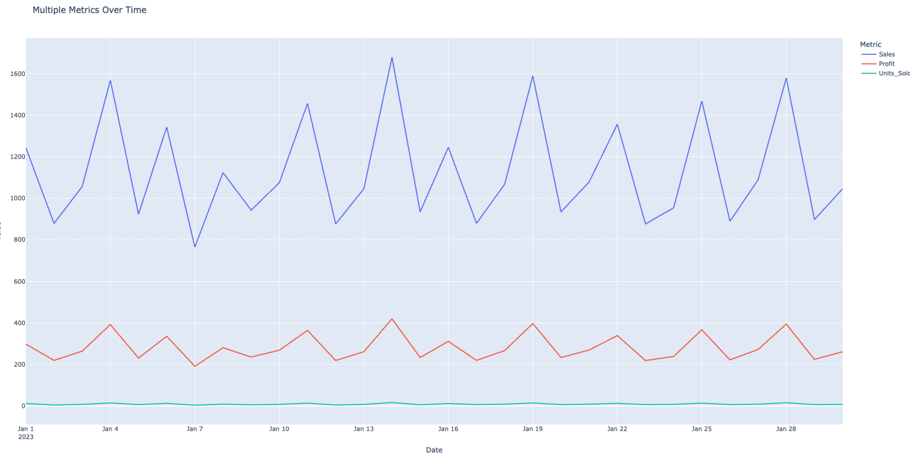
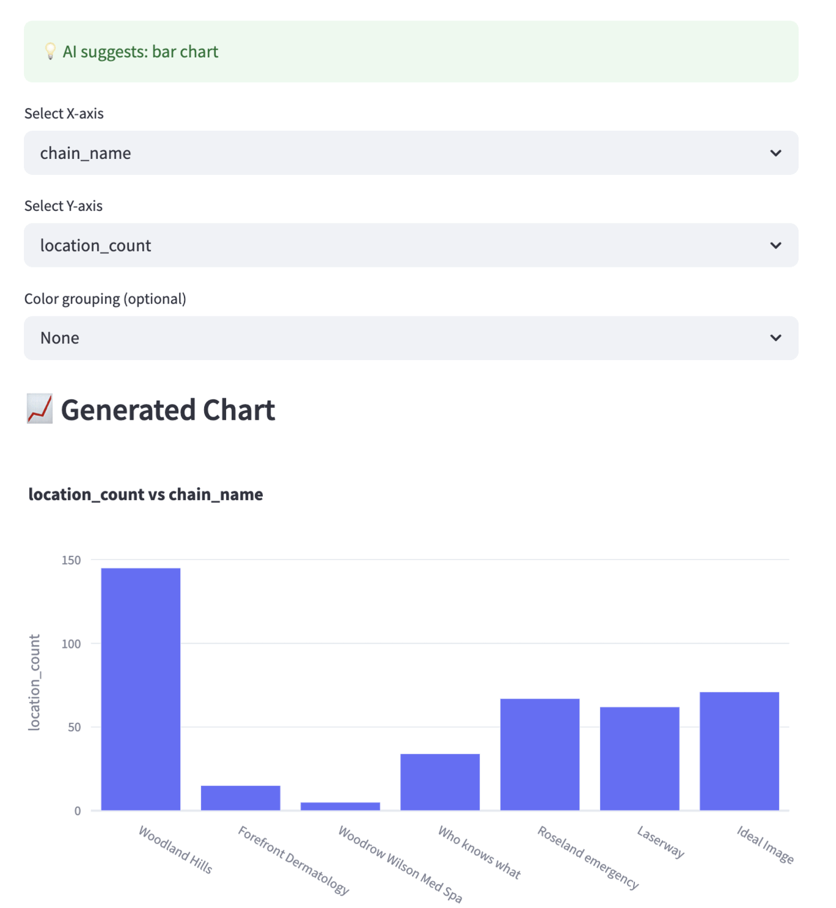

# 📊 PlotMatic 
AI-Driven Chart Generation with CSV & Plotly

[](https://streamlit.io/)
[](https://openai.com/)
[](LICENSE)

> Automatically suggest and generate the most appropriate visualizations from your data using rule-based heuristics or GPT-4.

PlotMatic intelligently analyzes your tabular data (CSV or in-memory) and generates insightful charts using Plotly. This project features two powerful approaches — a logic-based rules engine and a Large Language Model (LLM)-driven AI assistant — allowing you to explore your data visually with minimal effort.

---

## ✨ Features

- ⚙️ Dual Modes: Rule-based and LLM-based chart recommendations
- 🧠 Smart detection of variable types: categorical, numerical, datetime, binary, geospatial, and IDs
- 📊 Automated chart generation using Plotly
- 🧾 CSV preview and sample extraction
- 🎯 Intelligent default selection of x and y axes
- 🔄 Supports user customization for axes and grouping
- 🌐 Opens charts in a browser tab for rich interactivity

---

## 📁 Project Structure

This project is implemented in two modes:

### 1️⃣ Rule-based Approach

This approach uses a deterministic algorithm to analyze your CSV structure.

- Scans the CSV file to detect columns types:
  - Categorical
  - Numerical
  - Datetime
  - Binary
  - Geocoded
  - Identifier columns

- Applies chart suggestion rules based on column types
- Displays a menu of recommended chart types with associated X/Y axes
- Upon selection, renders the appropriate Plotly chart in a browser tab

🛠️ Usage:

```bash
python main.py
```

### Demo


### 2️⃣ LLM-based Approach (GPT-4)

Uses OpenAI’s GPT-4 (via LangChain) to introspect the structure and content of the CSV and intelligently suggest appropriate chart types.

🔍 Capabilities:

- Displays a preview of the uploaded CSV
- Uses LLM to suggest optimal visualization types
- Auto-selects recommended X/Y axes and grouping columns
- Allows user to override LLM suggestions and set preferred axes
  
🧠 Technologies Used:

- OpenAI GPT-4 via LangChain
- Plotly for visualization
- Streamlit interface

🛠️ Usage:

```bash
streamlit run chartapp.py
```

🛠️ Installation
Clone the repository:
```bash
git clone https://github.com/your-username/ChartsLLM.git
cd ChartsLLM
```

Create and activate a virtual environment:
```bash
python -m venv venv
source venv/bin/activate  # Windows: venv\Scripts\activate
```

Install dependencies:
```bash
pip install -r requirements.txt
```

### Demo


---
📚 Technologies Used
- 🐍 Python
- 📈 Plotly
- 🎨 Streamlit
- 🤖 OpenAI GPT-4
- 🧩 LangChain
- 🧹 Pandas & Numpy
